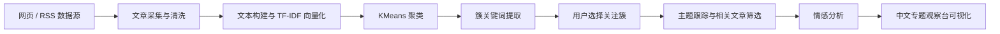

# 系统流程说明

## 整体处理链路

## 页面模块说明

- `主题簇网络与文章分布`
  - 用二维投影展示文章节点与簇中心
  - 允许直接点击簇中心切换关注主题

- `来源覆盖`
  - 展示当前样本覆盖到的网站/媒体来源
  - 让老师能直观看到数据用例更加丰富

- `可选择关注的主题簇`
  - 每个簇展示关键词、情感结构、来源样本和代表文章
  - 支持将某个簇设为关注主题

- `主题线索、来源和情感动态`
  - 展示当前关注主题的关键词、来源、情感柱状卡片
  - 通过时间线展示正面 / 中性 / 负面随日期的变化

## 数据模式

- `auto`
  - 优先尝试在线 RSS 抓取
  - 如果网络失败，自动回退到演示数据

- `demo`
  - 始终使用内置演示文章
  - 最适合课堂演示和离线答辩

- `live`
  - 强制使用在线 RSS 数据
  - 适合网络可用时展示实时抓取效果

## 演示数据扩展

- 当前内置演示集使用更多网站/来源样本
- 页面展示使用中文标题、中文摘要、中文来源名
- 聚类时仍保留英文原文特征，兼顾展示效果与聚类质量

## Figma 布局参考

- 中文聚类仪表盘布局：
  [中文聚类仪表盘布局](https://www.figma.com/online-whiteboard/create-diagram/42b61440-b962-4511-a20e-ec66cbdcb87d?utm_source=other&utm_content=edit_in_figjam&oai_id=&request_id=c2e1db4b-2eb4-4023-acb8-4a89027584f1)
